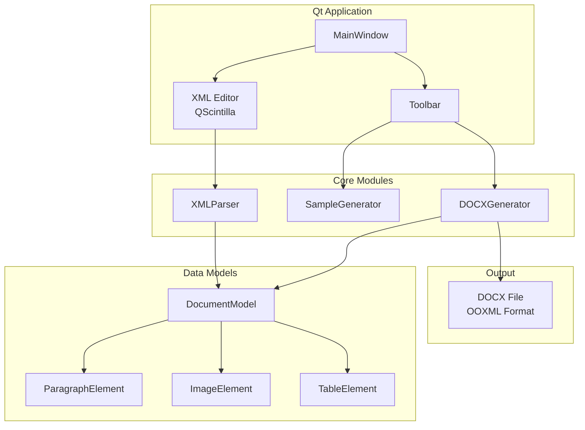
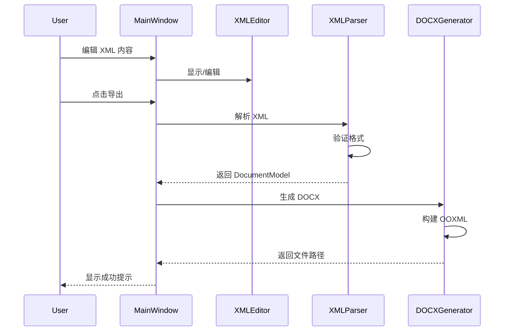

# Design Document: XML to DOCX Converter

## Overview

本设计文档描述了一个基于 Qt/C++ 的 XML to DOCX 转换器应用程序的技术架构和实现方案。应用程序允许用户通过 XML 配置文件定义文档结构，并将其导出为 Microsoft Word DOCX 格式。

系统采用模块化设计，主要包含以下核心组件：
- 主窗口界面（MainWindow）
- XML 编辑器（基于 QScintilla）
- XML 解析器（XMLParser）
- DOCX 生成器（DOCXGenerator）
- 示例生成器（SampleGenerator）

## Architecture



### 组件交互流程



## Components and Interfaces

### 1. MainWindow 类

主窗口类，负责 UI 布局和用户交互。

```cpp
class MainWindow : public QMainWindow {
    Q_OBJECT
public:
    explicit MainWindow(QWidget *parent = nullptr);
    ~MainWindow();

private slots:
    void onNewFile();
    void onOpenFile();
    void onSaveFile();
    void onExportDocx();
    void onGenerateSample(int sampleType);

private:
    void setupUI();
    void setupMenuBar();
    void setupToolBar();
    void setupEditor();
    
    QsciScintilla *m_editor;
    XMLParser *m_parser;
    DOCXGenerator *m_generator;
    SampleGenerator *m_sampleGenerator;
};
```

### 2. XMLParser 类

负责解析 XML 配置文件并构建文档模型。

```cpp
class XMLParser {
public:
    XMLParser();
    ~XMLParser();
    
    // 解析 XML 字符串，返回文档模型
    std::unique_ptr<DocumentModel> parse(const QString &xmlContent);
    
    // 验证 XML 格式
    bool validate(const QString &xmlContent, QString &errorMessage);
    
    // 将文档模型序列化为 XML
    QString serialize(const DocumentModel &model);

private:
    void parseDocument(QXmlStreamReader &reader, DocumentModel &model);
    void parseParagraph(QXmlStreamReader &reader, ParagraphElement &para);
    void parseImage(QXmlStreamReader &reader, ImageElement &image);
    void parseTable(QXmlStreamReader &reader, TableElement &table);
    StyleAttributes parseStyleAttributes(const QXmlStreamAttributes &attrs);
};
```

### 3. DOCXGenerator 类

负责将文档模型转换为 DOCX 文件。

```cpp
class DOCXGenerator {
public:
    DOCXGenerator();
    ~DOCXGenerator();
    
    // 生成 DOCX 文件
    bool generate(const DocumentModel &model, const QString &outputPath);
    
    // 获取错误信息
    QString lastError() const;

private:
    bool createDocxStructure(const QString &tempDir);
    bool writeContentTypes(const QString &tempDir);
    bool writeDocument(const QString &tempDir, const DocumentModel &model);
    bool writeStyles(const QString &tempDir);
    bool writeRelationships(const QString &tempDir);
    bool packageDocx(const QString &tempDir, const QString &outputPath);
    
    QString writeParagraph(const ParagraphElement &para);
    QString writeImage(const ImageElement &image);
    QString writeTable(const TableElement &table);
    QString styleToOOXML(const StyleAttributes &style);
    
    QString m_lastError;
    QMap<QString, QString> m_imageRelations;
};
```

### 4. SampleGenerator 类

负责生成示例 XML 文件。

```cpp
class SampleGenerator {
public:
    enum SampleType {
        BasicText = 0,
        RichText,
        TableSample,
        ImageSample,
        CompleteSample
    };
    
    SampleGenerator();
    
    // 生成指定类型的示例 XML
    QString generate(SampleType type);
    
    // 获取所有示例类型名称
    QStringList sampleNames() const;

private:
    QString generateBasicText();
    QString generateRichText();
    QString generateTableSample();
    QString generateImageSample();
    QString generateCompleteSample();
};
```

## Data Models

### DocumentModel

```cpp
struct StyleAttributes {
    QString fontFamily = "Arial";
    int fontSize = 12;
    QString color = "#000000";
    QString alignment = "left";      // left, center, right, justify
    bool bold = false;
    bool italic = false;
    bool underline = false;
};

struct ParagraphElement {
    QString text;
    StyleAttributes style;
};

struct ImageElement {
    QString src;
    int width = 0;      // 0 表示自动
    int height = 0;     // 0 表示自动
    QString alignment = "left";
};

struct CellElement {
    QString content;
    StyleAttributes style;
    QString alignment = "left";
    QString valign = "top";         // top, middle, bottom
    int colspan = 1;
    int rowspan = 1;
};

struct TableElement {
    int rows;
    int cols;
    QString widthType = "auto";     // auto, fixed, percent
    int width = 0;
    QVector<int> rowHeights;
    QVector<int> colWidths;
    QVector<QVector<CellElement>> cells;
};

struct DocumentModel {
    QString title;
    QVector<std::variant<ParagraphElement, ImageElement, TableElement>> elements;
};
```

### XML Schema 示例

```xml
<?xml version="1.0" encoding="UTF-8"?>
<document>
    <paragraph style="font-family:Arial; font-size:16; color:#333333; alignment:center; bold:true">
        文档标题
    </paragraph>
    
    <paragraph style="font-size:12; alignment:left">
        这是一段普通文本内容。
    </paragraph>
    
    <image src="./images/logo.png" width="200" alignment="center"/>
    
    <table rows="3" cols="3" width="auto">
        <row height="30">
            <cell alignment="center" style="bold:true">列1</cell>
            <cell alignment="center" style="bold:true">列2</cell>
            <cell alignment="center" style="bold:true">列3</cell>
        </row>
        <row>
            <cell>数据1</cell>
            <cell>数据2</cell>
            <cell>数据3</cell>
        </row>
    </table>
</document>
```

## Correctness Properties

*A property is a characteristic or behavior that should hold true across all valid executions of a system-essentially, a formal statement about what the system should do. Properties serve as the bridge between human-readable specifications and machine-verifiable correctness guarantees.*


### Property 1: XML Round-Trip Consistency

*For any* valid XML configuration document, parsing it into a DocumentModel and then serializing back to XML SHALL produce a semantically equivalent XML document.

**Validates: Requirements 5.5**

### Property 2: Style Attributes Preservation

*For any* XML document containing style attributes (font-family, font-size, color, alignment, bold, italic), the generated DOCX file SHALL contain the corresponding OOXML style elements with matching values.

**Validates: Requirements 2.1, 2.2, 2.3, 2.4, 2.5**

### Property 3: Table Structure Integrity

*For any* XML document containing a table element with specified rows, cols, row heights, and column widths, the generated DOCX file SHALL contain a table with the exact same structure and dimensions.

**Validates: Requirements 4.1, 4.2, 4.4, 4.5, 4.6, 4.7**

### Property 4: Image Embedding Correctness

*For any* XML document containing image elements with valid src paths, the generated DOCX file SHALL contain embedded images with the specified dimensions and alignment.

**Validates: Requirements 3.1, 3.2, 3.3, 3.4**

### Property 5: Invalid XML Error Detection

*For any* malformed XML input, the XML_Parser SHALL return an error and not produce a DocumentModel.

**Validates: Requirements 1.5**

### Property 6: DOCX Format Validity

*For any* valid XML configuration document, the generated DOCX file SHALL be a valid ZIP archive containing the required OOXML structure ([Content_Types].xml, word/document.xml, _rels/.rels).

**Validates: Requirements 7.1, 7.4**

## Error Handling

### XML 解析错误

| 错误类型 | 处理方式 |
|---------|---------|
| XML 格式错误 | 显示错误行号和错误描述，不生成文档 |
| 未知元素 | 记录警告，跳过该元素继续解析 |
| 缺少必需属性 | 使用默认值，记录警告 |
| 属性值无效 | 使用默认值，记录警告 |

### DOCX 生成错误

| 错误类型 | 处理方式 |
|---------|---------|
| 图片文件不存在 | 显示警告，跳过该图片继续生成 |
| 图片格式不支持 | 显示警告，跳过该图片继续生成 |
| 文件写入失败 | 显示错误信息，终止生成 |
| 磁盘空间不足 | 显示错误信息，终止生成 |

### 错误信息格式

```cpp
struct ParseError {
    int line;
    int column;
    QString message;
    ErrorSeverity severity;  // Warning, Error, Fatal
};
```

## Testing Strategy

### 单元测试

使用 Qt Test 框架进行单元测试：

1. **XMLParser 测试**
   - 测试各种有效 XML 的解析
   - 测试无效 XML 的错误处理
   - 测试样式属性的提取

2. **DOCXGenerator 测试**
   - 测试 OOXML 结构生成
   - 测试样式转换
   - 测试图片嵌入

3. **SampleGenerator 测试**
   - 测试各类示例的生成
   - 验证生成的 XML 格式正确

### 属性测试

使用 RapidCheck 或自定义生成器进行属性测试：

1. **Round-Trip 测试**
   - 生成随机有效 XML
   - 解析 → 序列化 → 再解析
   - 验证结果等价

2. **样式保持测试**
   - 生成随机样式组合
   - 验证 DOCX 输出包含正确样式

3. **表格结构测试**
   - 生成随机表格配置
   - 验证 DOCX 表格结构正确

### 集成测试

1. **端到端测试**
   - 从 XML 输入到 DOCX 输出的完整流程
   - 验证生成的 DOCX 可被 Word 打开

2. **Docker 部署测试**
   - 验证容器正确启动
   - 验证端口映射正确
